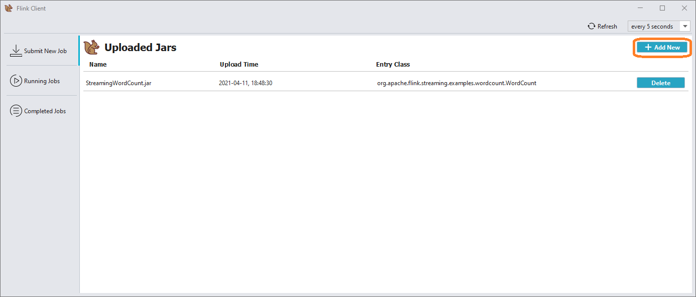
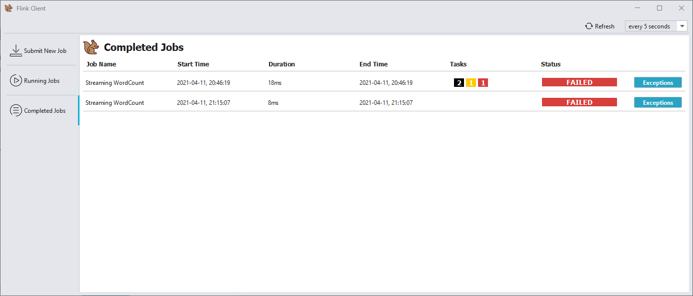

# Flink Client Documentation
This application allows you to upload .jar files on the Apache Flink cluster, observe existing jars on the cluster and run any of them with specified parameters.  

___Apache Flink___ is a framework and distributed processing engine for stateful computations over unbounded and bounded data streams. 
Flink has been designed to run in all common cluster environments, perform computations at in-memory speed and at any scale.  

With this application you can also observe all the jobs previously launched (running and finished) and see if there any exceptions occurred in process.

## Getting Started
See the guide below to install the Apache Flink on your machine:
- [Local Installation](https://ci.apache.org/projects/flink/flink-docs-stable/try-flink/local_installation.html)

You can setup your Flink cluster with standalone configuration using external resources:
- [Docker Setup](https://ci.apache.org/projects/flink/flink-docs-release-1.12/deployment/resource-providers/standalone/docker.html)
- [Kubernetes Setup](https://ci.apache.org/projects/flink/flink-docs-release-1.12/deployment/resource-providers/standalone/kubernetes.html)

When it's done, you can start the Flink Client.

# Application Guide
Once you start the Flink Client application you will see the following connection dialog:

Type Flink cluster URL in the given text box (_default is http://localhost:8081_) and press ___Connect___ button.
The application will check if the given URL is accessible and ___Main Window___ will open:

## Main Window
Here you go! Now you can surf through the Main Window interface. To switch between existing Uploaded, Running and Completed jobs use tabs on the left pane:

## Upload New Job
When on the "___Submit New Job___" tab press the "___+ Add New___" button and choose file in your system (file extension should be _.jar_ or _.py_):

## Submit Job
Once the file is uploaded, find it in the list and click on it's row. Properties pane will appear.  
Specify parameters, which you wish to run this job with, and click "___Submit___" button:

To see the job plan, click on the "___View Plan___" button in the same pane:

If something went wrong (_e.g. if specified submit parameters are incorrect_), Flink Client will show the error dialog with detailed description:

## Running/Completed Jobs
Once you've submitted the job, you can observe its status in __Running Jobs__ tab (if the job is still running) or in __Completed Jobs__ tab (if it's completed):

During job processing some errors may occur. To see thrown exceptions for particular job, click on the "___Exceptions___" button:

To define the count of Total/Failed/Finished/etc. tasks for job, point on appropriate icons above the _Tasks_ column.

## Auto Refreshing
If you wish to set Main Window Auto Refresh mode, you can use the appropriate function on Menu Bar:

You can also refresh it immediately by pressing the refresh button on the left.

### Enjoy your Flinking!
